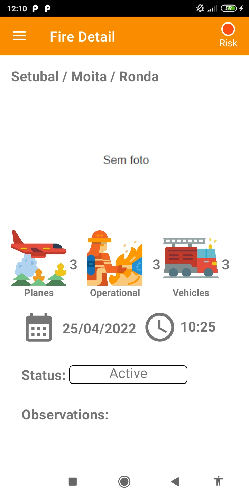

+ João Novaes Barreiros a21900074
+ Matheus Barcelos Rodrigues Alves a21800876

Screenshots:

    
    

    
    

    

Tabela Parte 1:

| Descrição | Implementado? |
| ------ | ----------- |
| Dashboard | Implementado |
| Apresentação dos incêndios - Lista | Implementado |
| Apresentação dos incêndios - Lista - Rotação | Implementado |
| Apresentação dos incêndios - Mapa (imagem) | Implementado |
| Detalhe do incêndio | Implementado |
| Risco de zona | Implementado |
| Registo de incêndios | Implementado |
| Suporte multi-idioma | Implementado |
| Navegabilidade | Implementado |
| Extra | Implementado |

Tabela Parte 2:

| Descrição | Implementado? |
| ------ | ----------- |
| Dashboard | Implementado |
| Filtro por nome do distrito | Implementado |
| Filtro por raio circundante à localização do dispositivo | Implementado |
| Apresentação dos incêndios -Lista (já com rotação)  | Implementado |
| Apresentação dos incêndios - Mapa (com localização) | Implementado |
| Detalhe do incêndio | Implementado |
| Risco de zona | Implementado |
| Registo de incêndios | Implementado |
| Autonomia | Não Implementado |
| Offline | Implementado |
| Extra  | Implementado |
| Video | Feito |

Video = https://www.youtube.com/watch?v=QwRPN44-f_U

Autoavaliação Parte 1 = 19 \
Autoavaliação Parte 2 = 18 \

Descrição do Ecrã Extra: \
Este ecrã terá informações sobre estatíscas variadas dos incêndios. \
Agora na segunda parte as estatíscas vem de informações da API. \
\
Neste entrega temos as seguintes estatíscas:

+ Fogos ativos
+ Distrito com mais fogos ativos
+ Distrito com mais fogos
+ Fogo com mais meios utilizados