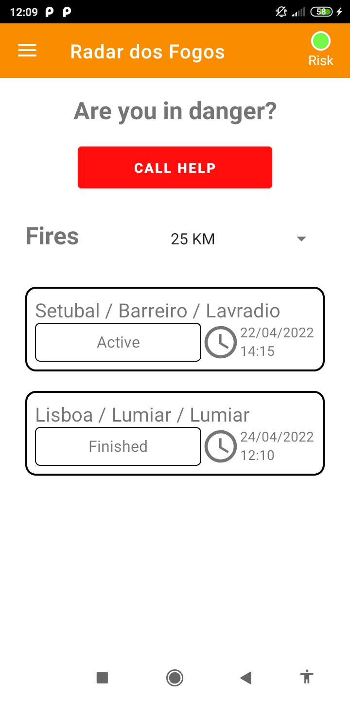
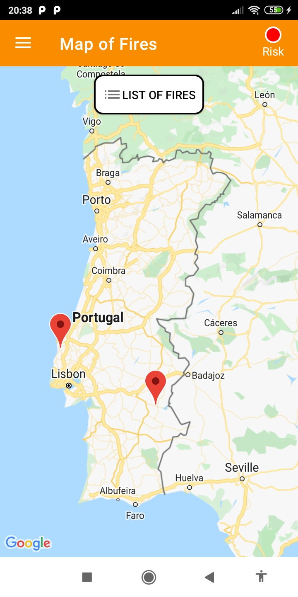
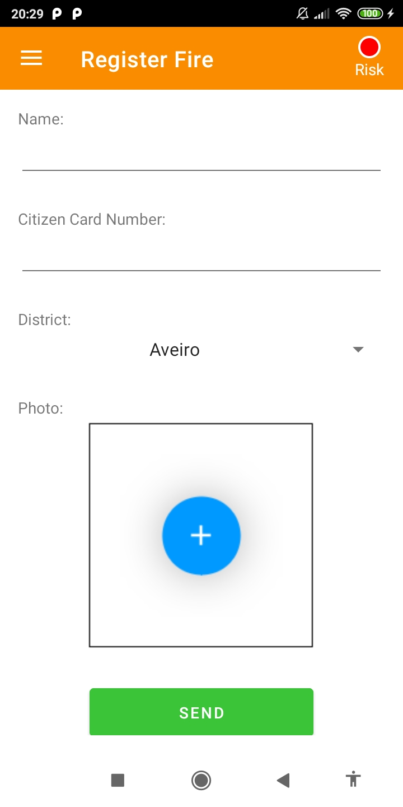

+ João Novaes Barreiros a21900074
+ Matheus Barcelos Rodrigues Alves a21800876

Screenshots:

    
    

    

| Descrição | Implementado? |
| ------ | ----------- |
| Dashboard | Implementado |
| Apresentação dos incêndios - Lista | Implementado |
| Apresentação dos incêndios - Lista - Rotação | Implementado |
| Apresentação dos incêndios - Mapa (imagem) | Implementado |
| Detalhe do incêndio | Implementado |
| Risco de zona | Implementado |
| Registo de incêndios | Implementado |
| Suporte multi-idioma | Implementado |
| Navegabilidade | Implementado |
| Extra | Implementado |

Autoavaliação = 19

Descrição do Ecrã Extra:
Este ecrã terá informações sobre estatíscas variadas dos incêndios, \
neste entrega temos as seguintes estatíscas:

+ Fogos ativos
+ Distrito com mais fogos ativos
+ Distrito com mais fogos
+ Fogo com mais meios utilizados